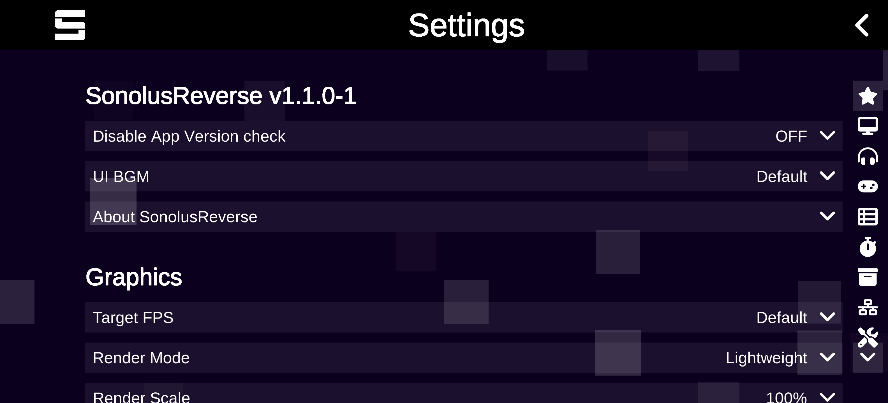

> [!WARNING]  
> This Project is for **educational and research purposes only**. **Not affiliated with Sonolus**; using this mod may violate Sonolus' [TOS](https://sonolus.com/tos) and [EULA](https://sonolus.com/eula).  
> **Use at your own risk.** I'm **NOT** responsible for bans or anything else that happens to you or your account.  
> If you enjoy Sonolus, please consider supporting Sonolus by purchasing VIP or gems in-game.  
> If you want to contact me: see [Contact Me](#contact-me)

> [!WARNING]
> Following a request from the Sonolus developer, certain features **have been removed** from this project.  
> Pre-built APKs are **no longer distributed**.

# SonolusReverse

A mod for the [Sonolus](https://sonolus.com/) rhythm game with extra features, written using [Frida](https://frida.re/) and [frida-il2cpp-bridge](https://github.com/vfsfitvnm/frida-il2cpp-bridge)

For announcements and support, join our community on Discord: [SonolusReverse Discord](https://discord.gg/43FsKRzxnf)

## Screenshots

## Features

- **Custom Settings Section**
- **Version Spoof**: Override the version used by the client compatibility checks
- **Custom UI BGM**: Change the UI background music to your own!

##### Planned:

See our [TODO](TODO.md). To contribute, see [Contributing](#contributing)

## Installation

**No pre-built APKs are distributed.** You can follow one of these guides:

**✅ Android**: See the [contributing guide](#contributing) for instructions.

**⚠️ iOS**: A guide by [JexOpy](https://github.com/JexOpy) is available [here](https://gist.github.com/JexOpy/3aed12c92824921449ba68cb5b041133).
**Note**: There may also be issues patching functions on recent iOS versions _(iOS 26+)_: see [Frida issue #3650](https://github.com/frida/frida/issues/3650). **It should work fine on older iOS versions.**

## Contributing

Got ideas? Want to add localization? Found a bug? Pull requests and issues are welcome!  
Please read our [Contributing Guide](CONTRIBUTING.md)

## Contact Me

My contacts are on my GitHub Profile - [@repinek](https://github.com/repinek/)

## License

This project is licensed under the **GNU General Public License v3.0**.
See the [LICENSE](LICENSE) file for details.

## Acknowledgements

- [Frida Documentation](https://frida.re/docs/) - General Frida API reference.
- [frida-il2cpp-bridge Wiki](https://github.com/vfsfitvnm/frida-il2cpp-bridge/wiki) - Specific API for the IL2CPP used in this project.
- [fallguys-frida-modmenu](https://github.com/repinek/fallguys-frida-modmenu) - Some Code and architecture adapted from my earlier Frida project.
- [Gene Brawl](https://github.com/RomashkaTea/genebrawl-public) - Some code and architecture adapted from Gene Brawl.
